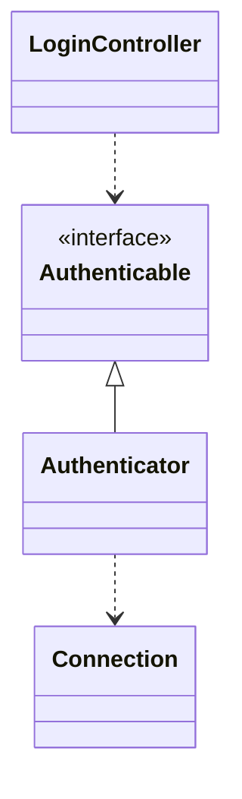
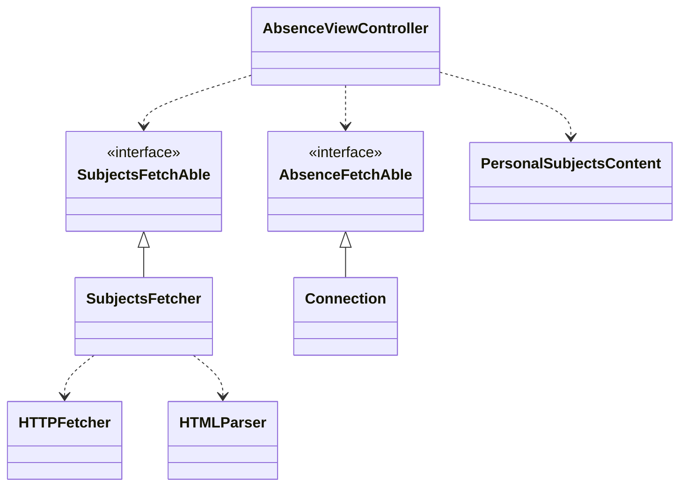
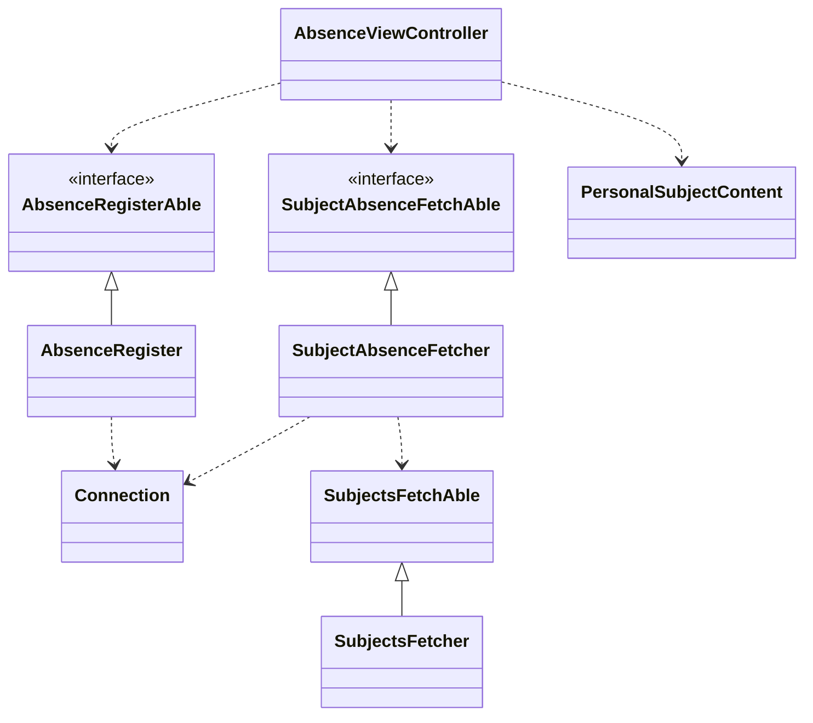
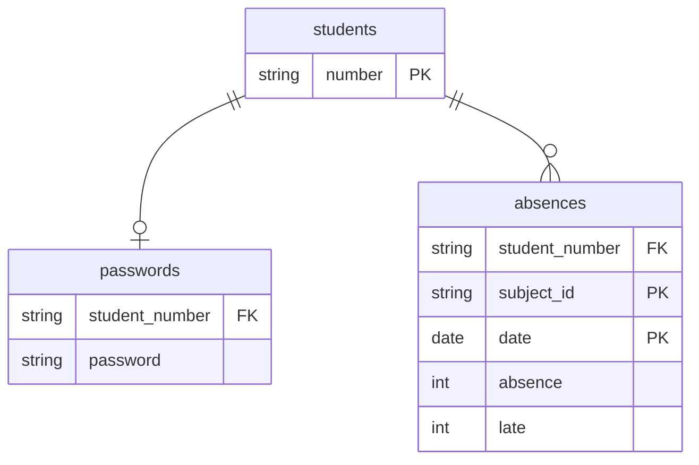

# 欠課時数記録アプリ

## 動作URL

ゲストログインで実際に使用してみることが可能です。基本的にスマートフォン用となっています。

[https://krmm.work](https://krmm.work)

## デザイン案
[Figma](https://www.figma.com/file/FDXlNdULyNragSETCf4cpd/%E6%AC%A0%E8%AA%B2%E6%99%82%E6%95%B0%E7%AE%A1%E7%90%86app?node-id=4%3A115)で作成したデザイン

## 概要

欠課時数と遅刻回数を記録し、留年の条件である3分の1以上の欠課を満たさないように管理するWebアプリケーション。

## 動機

欠席しがちな友人がいて、乱雑な友人で欠席日数を数えていないけれど、友人が留年してしまわないように、乱雑な友人でも簡単に記録ができて残りの欠課しても留年しない日数を明確にしてあげたい。

## 解決策

簡単に入力ができて、欠席回数と遅刻回数を記録でき、なおかつ後何回休んだら留年してしまうのかを教えてくれるWebアプリケーションを作成する。

## 対象外

現在のところ、以下の機能に対応しない。

- 新規アカウント作成機能
- 科目カスタマイズ機能

## 画面ごとの仕様

### ログイン画面(GET /login, POST /login)

ユーザーIDとパスワードを入力して、ログインボタンを押すと、ホームページへ遷移する。ログイン状態にない場合は、自動的にこの画面にリダイレクトする。
認証に失敗すると、失敗したことを表示し、再度入力を促す

### 欠課時数表示画面(GET /)

科目ごとに欠課数と最大欠課数、と遅刻数と最大遅刻数、遅刻は3回で欠席1回にカウントされるため、3回になると、遅刻回数が0回にリセットされ、欠席回数が+1される。

科目は、スクレイピングを行なって、学校のシラバスから取得する。

科目の文字列をクリックすると、その科目の遅刻・欠席入力フォームへ遷移する。

### 欠課登録画面(GET /register)

科目の欠課と遅刻を登録する画面。日付(西暦月日)と欠課回数と遅刻の有無を登録する。
欠課時数表示画面へ戻るボタンもある。

## 使用技術

- フロントエンド
    - Vue3 CDN
    - TypeScript
    - Sass SCSS
    - Java Spark Velocity Template Engine
- バックエンド
    - Java Spark
    - MySQL
    - JDBC
- インフラ
    - Docker
    - VPS Ubuntu 22.04
    - GitHub Actions
    - Nginx

## Architecture

Clean Architectureを採用

### Login Controller

データベースの参照により遷移する

### Absence Controller

科目を奈良高専Webシラバスからスクレイピングで取得し、表示する。

### RegisterController

入力された値をデータベースに追加、または上書きを行う

## DB

## ローカル開発環境構築

1. Dockerをインストール
2. docker compose up -d

